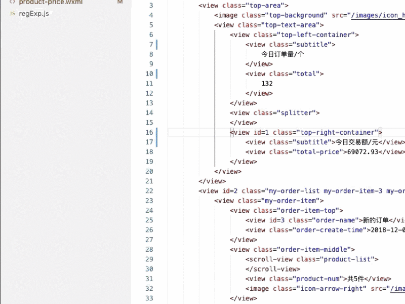

# HtmlFindClass README

## Features
在支持的文件中，单击右键->选择HtmlFindClass。如若选中的文件格式正确，则会在选中文件的所在目录输出一个以"文件名+.css"的文件，右下角会提示生成文件的路径。这样就省去了单独拷贝class样式的时间。

目前支持的文件格式有：html、vue、wxml。

Wxml文件示例：



我的联系方式：sahadev@foxmail.com

## Release Notes

### 1.1.0
- 去除冗余依赖库
- 去除冗余命令
- 去除冗余输出日志
- 完善输出结果内容
- 降低最低兼容版本号
- 增加对html, wxml, vue文件的支持

### 1.3.0
- 对class的值去重
- 支持多个class值，例如：class="a b c" 将会生成=> .a{} .b{} .c{}

### 1.4.0
- 支持ID选择器与TAG选择器
- 对结构进行了重构，支持多种命令注入执行
- 修复一些Bug

### 1.5.0
- 对新增的class/id/tag做文件追加。也就是说在原来的文件中新添加了class，那么再运行插件，则会在*.css文件中追加这部分新增。结果可参考/test/product-price.wxml.css
```css
    /* =============== 以下结果追加于: 1/14/2020, 2:18:59 PM =============== */
    .xxxxxx {
    }

    .yyyyy {
    }

    .zzzzz {
    }
```

### 1.6.0
- 唯一性选择器: '-'. 当有class选择器的值是以'-'开头时，类似'-item'，则会自动输出该选择器在当前环境中的唯一选择。

## TODO
- 支持对Vue文件做专门处理，会自动在Vue文件的Style标签内追加新属性。
- 对Sass、Less写法做支持。支持输出sass类的树形结构代码
- 对于Sass/Scss在遍历时遵循的规则为：id>class>tag
- 支持pug类型的文件。
- 对小程序的wxml文件单独处理，在wxml文件中写出的样式自动写入到wxss中，而不是wxml.css中。
- 开启文件监听器实现实时生成的能力 -watch //https://nodejs.org/dist/latest-v12.x/docs/api/fs.html#fs_fs_watch_filename_options_listener
- 对Sass的支持：如果在检测class时发现命名是以"-"开头的，则输出时以scss方式输出或者以父子选择器输出。#限制：不能输出嵌套规则。无法通过单次的运行确认某个选择器在某个节点中是唯一使用的。
- 改写htmlparser2，实现深度与节点对象回调。深度从0开始，节点对象可以追溯所有的父节点。对象回调时通过代理回调，防止外部更改内部对象。

----

**HtmlFindClass插件要解决什么问题？**
> 核心目的是要解决：html到css之间样式匹配关系的重复书写问题。这是这个插件的实现方向。