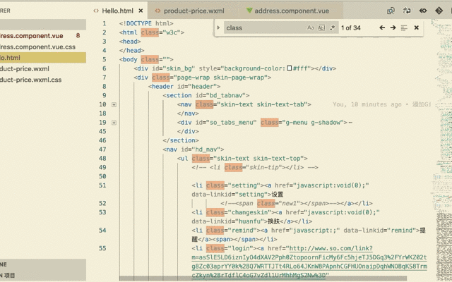

# HtmlFindClass README

## Features
在插件支持的文件中，单击右键->选择HtmlFindClass。如若选中的文件格式正确，则会在选中文件的所在目录输出一个以"文件名+.css"的文件，右下角会提示生成文件的路径。这样就省去了单独拷贝class样式的时间。

In the plug-in supported file, right-click -> select HtmlFindClass. If the selected file format is correct, a file with "filename. css" will be output in the directory where the selected file is selected, and the lower right corner will prompt for the path of the file to be generated. This saves time to copy class styles separately.

目前支持的文件格式有：html、vue、wxml。

Currently supported file extensions are: html,vue,wxml.

Html文件示例：

如果需要生成id或者其它选择器，欢迎大家上手完善这个插件。

我的联系方式：sahadev@foxmail.com

If you need to generate id or other selectors, you are welcome to start perfecting this plug-in. My contact information: sahadev@foxmail.com

## Known Issues
暂时没有收到问题反馈，静待更新。

No problem feedback has been received for the time being, waiting to be updated.

## Release Notes

### 1.1.0
- 去除冗余依赖库
- 去除冗余命令
- 去除冗余输出日志
- 完善输出结果内容
- 降低最低兼容版本号
- 增加对html,wxml,vue文件的支持

- Remove the redundant dependency library
- Remove redundant commands
- Remove the redundant output log
- Improve output results
- Reduce the minimum compatible version number
- Increased support for html, wxml, and vue files

### 1.3.0
- 对class的值去重
- 支持多个class值，例如：class="a b c" 将会生成=> .a{} .b{} .c{}

## TODO
- 支持其它类型选择器，例如标签选择器、ID选择器、属性选择器等。
- 支持对Vue文件做专门处理，会自动在Vue文件的Style标签内追加新属性。
- 对Sass、Less写法做支持。
- 支持pug类型的文件